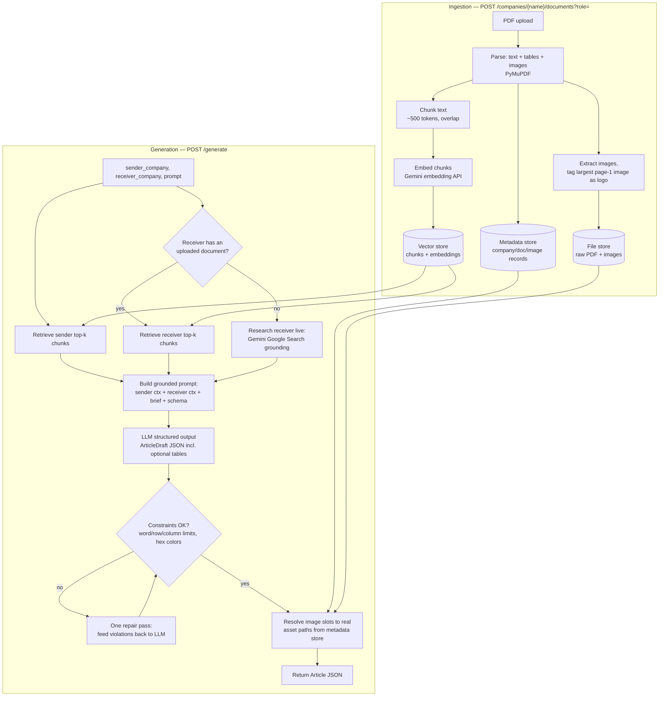

# Design: Generative Marketing App

## Problem & goal

The client's editors manually: (1) research a Sender and Receiver company from their
websites/collateral, (2) write a bridging B2B article, (3) source logos/images, and
(4) hand-lay-out the result into a fixed publishing template.

**Goal:** turn steps 1–4 into one pipeline — get context (upload for the sender;
upload or live web research for the receiver) → generate a structured,
constraint-respecting article JSON (text, images, optional tables) → render it. The
expected output of every `/generate` call is a single JSON object matching the schema
in `app/generation/schema.py`, grounded only in real content for that sender and
receiver — never invented. `studio/` renders it into an actual brochure — the
downstream renderer originally out of scope here now exists as a real prototype, not
just a plan; see [`README.md`](../README.md#core-genai-concepts-this-applies)
for how each stage below maps onto standard GenAI/RAG building blocks (chunking,
embeddings, retrieval, grounding, structured output, self-correction), and
[`agentic-ai-stack.md`](agentic-ai-stack.md) for a technology-by-technology breakdown
against the fuller set of agentic-AI cores (including the ones this app deliberately
doesn't implement, like tool use and planning).

## Pipeline

Design choices worth calling out:

1. **The LLM never invents an asset path.** It only picks from a fixed vocabulary of
   image *slots* (`hero` / `sender_logo` / `receiver_logo`). A deterministic
   server-side step resolves each slot to a real file extracted from the uploaded PDFs
   (or `null` if none exists). This is what keeps "factually correct" true for images,
   not just text.
2. **Grounding, not free generation.** The system prompt requires every claim to trace
   back to retrieved Sender/Receiver context, and to generalize rather than fabricate
   when the context doesn't support a specific claim.
3. **Retrieval is scoped per company *and* role.** The vector store query filters on
   both `company_name` and `role` at once, so a sender's chunks can never leak into the
   receiver's retrieved context (or vice versa) even if both companies uploaded PDFs
   with overlapping vocabulary. Combining two metadata fields in one query means the
   filter has to be expressed as a compound (`$and`) condition, not two independent
   equality checks.
4. **The repair pass is deterministic-triggered, not model-initiated.** The LLM doesn't
   decide when to retry; `validate_constraints` checks hard, countable rules (word
   limits, hex color format) that an LLM can't reliably self-police, and only then is a
   second call made with the violations attached. This keeps the one-repair-pass
   behavior predictable and boundable, rather than an open-ended agent loop.
5. **The receiver-document-vs-live-research decision is made once, by application
   code, before generation starts — not by the model mid-reasoning.** A single check
   (`metadata_store.list_documents(receiver_company, role="receiver")`) picks the
   branch; the LLM is never given the option to call the search tool itself. This
   keeps the "one real tool call, one fixed decision point" scope boundary explicit —
   see [`agentic-ai-stack.md`](agentic-ai-stack.md#35-tool-use--the-one-place-this-app-actually-calls-an-external-tool)
   for why that boundary matters. Practical consequence: grounded search sits on a much
   stricter quota than plain generation on Gemini's free tier. `CompanyResearchClient`
   handles this with one free fallback (Tavily's search API, if `TAVILY_API_KEY` is
   set) rather than retrying Gemini or silently ungrounding itself; only without that
   key does this path return a clear 502 (upload a receiver PDF instead).

## Azure production architecture

Same pipeline, cloud-native and horizontally scalable. `FileStore` and `MetadataStore`
(`app/storage/`) are the prototype's swappable interfaces and map directly onto Blob
Storage / Cosmos DB below. The LLM, embeddings, and vector store have no custom
interface layer — they're LangChain clients constructed directly in
`app/dependencies.py` — so their production mapping is a matter of swapping that one
file's client construction, not implementing a new adapter. See
[`agentic-ai-stack.md`](agentic-ai-stack.md) for what each of these pieces is doing in
agentic-AI terms.

**Why decouple upload from processing:** PDF parsing + embedding is the slow,
variable-latency step. The upload endpoint returns `202 Accepted` immediately once the
raw PDF is in Blob Storage; an Event Grid-triggered function does the actual
extraction/chunking/embedding asynchronously. This keeps the synchronous API path fast
and lets ingestion scale independently (e.g. burst-upload a whole account's collateral
without blocking the request-serving tier). A status endpoint or webhook reports
completion.

**Why Azure AI Search over a self-hosted vector DB:** hybrid (vector + keyword) search,
managed scaling, and native filtering on `company_name`/`role` metadata — the same
filtered-query pattern the prototype uses against Chroma.

**Scaling story:** the API tier is stateless and scales horizontally via Container Apps;
ingestion is queue/event-decoupled from the request path; the vector index and the LLM
deployment both scale independently of the API tier.

**Auth & observability:** APIM subscription keys or Azure AD in front of the API;
Key Vault for all secrets (no keys in app config); App Insights traces each LLM call
(prompt/response/latency) for debugging factual-grounding issues in production.

## What's out of scope for this prototype (and why)

- **Production-grade layout rendering** — `studio/` renders the article JSON into an
  actual styled brochure (print-to-PDF via the browser), which covers the prototype
  need, but it's a single hardcoded layout, not a real InDesign/PDF pipeline with
  print-accurate typography, pagination, or bleed/margin handling.
- **Multi-template support / brand-rule engine** — the schema in `schema.py` and
  `studio/`'s rendering are both representative of *a* template; production would load
  the client's real template definitions and support switching between several.
- **Async ingestion** — the prototype processes uploads synchronously for simplicity;
  the Azure design above decouples this, as described.
- **Retry/backoff on receiver web research** — a quota/rate limit on Gemini's Google
  Search grounding tool is not retried with backoff. It does have one alternate
  provider: `CompanyResearchClient` falls back to Tavily's free-tier search API
  (`TAVILY_API_KEY` in `.env`) on a 429, still under the same "never invent" grounding
  rule; only when that's unset (or itself fails) does the request surface a 502 with
  the upload-a-receiver-PDF workaround.
