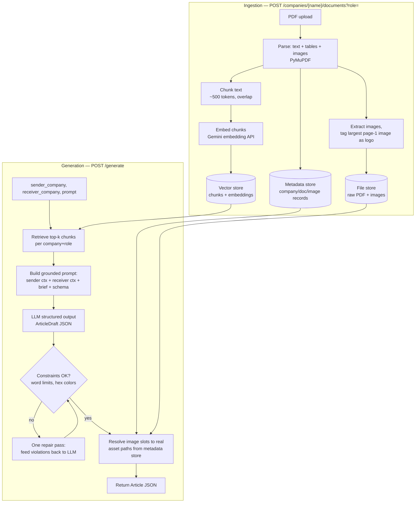
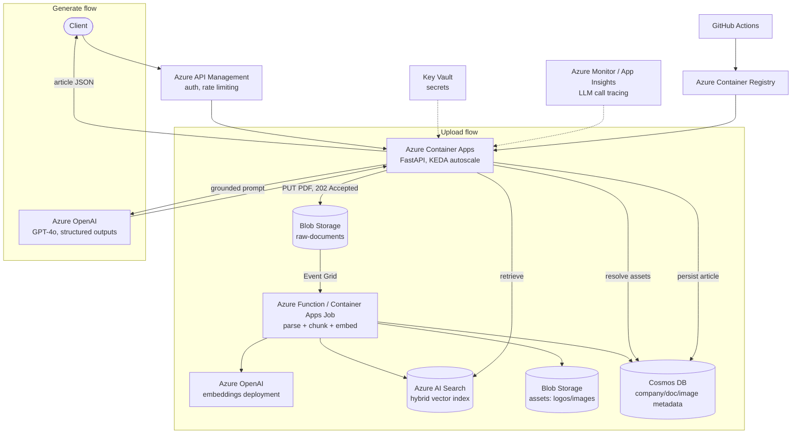

# Design: Generative Marketing App

## Problem & goal

The client's editors manually: (1) research a Sender and Receiver company from their
websites/collateral, (2) write a bridging B2B article, (3) source logos/images, and
(4) hand-lay-out the result into a fixed publishing template.

**Goal:** turn steps 1–3 into one pipeline — upload context PDFs → retrieve relevant
grounding → generate a structured, constraint-respecting article JSON — so a downstream
renderer (out of scope here) can map that JSON straight into the actual template. The
expected output of every `/generate` call is a single JSON object matching the schema in
`app/generation/schema.py`, grounded only in what was actually uploaded for that sender
and receiver — never invented. See [`README.md`](../README.md#core-genai-concepts-this-applies)
for how each stage below maps onto standard GenAI/RAG building blocks (chunking,
embeddings, retrieval, grounding, structured output, self-correction).

## Pipeline

Design choices worth calling out:

1. **The LLM never invents an asset path.** It only picks from a fixed vocabulary of
   image *slots* (`hero` / `sender_logo` / `receiver_logo`). A deterministic
   server-side step resolves each slot to a real file extracted from the uploaded PDFs
   (or `null` if none exists). This is what keeps "factually correct" true for images,
   not just text.
2. **Grounding, not free generation.** The system prompt requires every claim to trace
   back to retrieved Sender/Receiver context, and to generalize rather than fabricate
   when the context doesn't support a specific claim.
3. **Retrieval is scoped per company *and* role.** The vector store query filters on
   both `company_name` and `role` at once, so a sender's chunks can never leak into the
   receiver's retrieved context (or vice versa) even if both companies uploaded PDFs
   with overlapping vocabulary. Combining two metadata fields in one query means the
   filter has to be expressed as a compound (`$and`) condition, not two independent
   equality checks.
4. **The repair pass is deterministic-triggered, not model-initiated.** The LLM doesn't
   decide when to retry; `validate_constraints` checks hard, countable rules (word
   limits, hex color format) that an LLM can't reliably self-police, and only then is a
   second call made with the violations attached. This keeps the one-repair-pass
   behavior predictable and boundable, rather than an open-ended agent loop.

## Azure production architecture

Same pipeline, cloud-native and horizontally scalable. The prototype's swappable
interfaces (`LLMClient`, `VectorStore`, `EmbeddingClient`, `FileStore`,
`MetadataStore` — see `app/`) map directly onto these managed services:

**Why decouple upload from processing:** PDF parsing + embedding is the slow,
variable-latency step. The upload endpoint returns `202 Accepted` immediately once the
raw PDF is in Blob Storage; an Event Grid-triggered function does the actual
extraction/chunking/embedding asynchronously. This keeps the synchronous API path fast
and lets ingestion scale independently (e.g. burst-upload a whole account's collateral
without blocking the request-serving tier). A status endpoint or webhook reports
completion.

**Why Azure AI Search over a self-hosted vector DB:** hybrid (vector + keyword) search,
managed scaling, and native filtering on `company_name`/`role` metadata — the same
filtered-query pattern the prototype uses against Chroma.

**Scaling story:** the API tier is stateless and scales horizontally via Container Apps;
ingestion is queue/event-decoupled from the request path; the vector index and the LLM
deployment both scale independently of the API tier.

**Auth & observability:** APIM subscription keys or Azure AD in front of the API;
Key Vault for all secrets (no keys in app config); App Insights traces each LLM call
(prompt/response/latency) for debugging factual-grounding issues in production.

## What's out of scope for this prototype (and why)

- **Layout rendering** (turning the article JSON into an actual PDF/InDesign file) —
  this project produces the JSON that *maps into* the template, not the renderer itself.
- **Multi-template support / brand-rule engine** — the schema in `schema.py` is
  representative; production would load the client's real template definitions.
- **Async ingestion** — the prototype processes uploads synchronously for simplicity;
  the Azure design above decouples this, as described.
